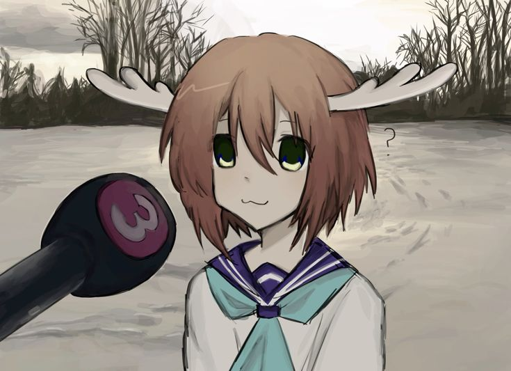
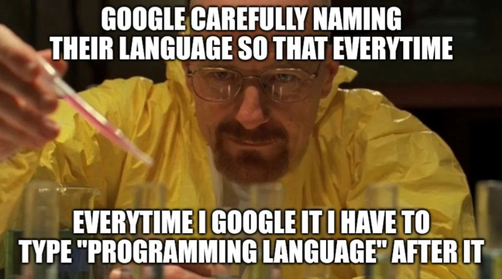

# OLENь - Бот-перекладач

## Про бота
Цей телеграм бот перекладає слова чи речення з таких мов, як англійська, 
іспанська, турецька, французька, німецька, шведська на українську мову і навпаки.

### Як працює переклад?

Щоб перекласти з доступної мови на українську мову, достатньо просто надіслати потрібний текст.

Щоб перекласти з української на вибрану доступну мову, перед текстом вкажіть вибрану мову:

1. /en - з 🇺🇦 на 🇺🇸
2. /de - з 🇺🇦 на 🇩🇪
3. /tr - з 🇺🇦 на 🇹🇷
4. /es - з 🇺🇦 на 🇪🇸
5. /fr - з 🇺🇦 на 🇫🇷
6. /sv - з 🇺🇦 на 🇸🇪

### Щоб запустити:

1. Створіть бота в [BotFather](https://t.me/BotFather)
2. Створіть акаунт в [DeepL](https://www.deepl.com/en/translator)
3. Отримайте DeepL API та Telegram API.
4. Встановіть та налаштуйте [GoLand](https://www.jetbrains.com/go/)
5. Внесіть Ваші API в environmental variables в проєкті GoLand
6. Запустіть.

### Автор
* **Олег Мручко** - *Оригінальний код* - [olezhkoistaken](https://github.com/olezhkoistaken) aka [wruthx](https://github.com/wruthx)

